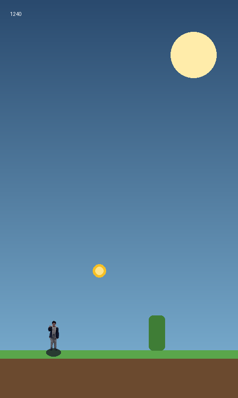

# George Jump 🏃

모바일 브라우저에서 바로 즐기는 **원탭 무한 점프 게임**입니다.
주인공 캐릭터(George)는 실제 사진을 픽셀 아트로 변환해서 만들었습니다.



## 플레이 방법
- **화면을 탭**하면 점프합니다. (공중에서 한 번 더 탭 → **더블 점프**)
- 키보드: `Space` 또는 `↑`
- 🌵 선인장 장애물을 피하고, 🪙 G-코인을 모아 점수를 올리세요.
- 시간이 지날수록 빨라집니다. 최고 점수는 자동 저장됩니다.

## 실행
설치할 것 없이 `index.html`을 브라우저로 열면 됩니다.

로컬 서버로 실행하려면(모바일 실기기 테스트 권장):
```bash
python3 -m http.server 8000
# 브라우저에서 http://localhost:8000 접속
```

## 캐릭터 교체 (사진 → 픽셀 아트)
다른 사진으로 캐릭터를 바꾸려면:
```bash
pip install pillow numpy rembg onnxruntime
python3 tools/pixelize.py 내사진.jpg assets/george.png
```
배경을 자동 제거하고 64px 높이의 픽셀 스프라이트로 변환합니다.
게임은 `assets/george.png`를 주인공으로 사용합니다.

## 구성
| 파일 | 설명 |
|------|------|
| `index.html` | 게임 전체 (HTML + CSS + JS, 런타임 의존성 없음) |
| `assets/george.png` | 사진에서 변환한 주인공 스프라이트 |
| `tools/pixelize.py` | 사진 → 픽셀 아트 변환 스크립트 (개발용) |

## 기술
- 순수 HTML5 Canvas 2D, 외부 라이브러리 없음
- 반응형 캔버스(논리 좌표 + 화면 비율 스케일), DPR/노치 대응
- 터치 스크롤·줌 방지, `requestAnimationFrame` 게임 루프
